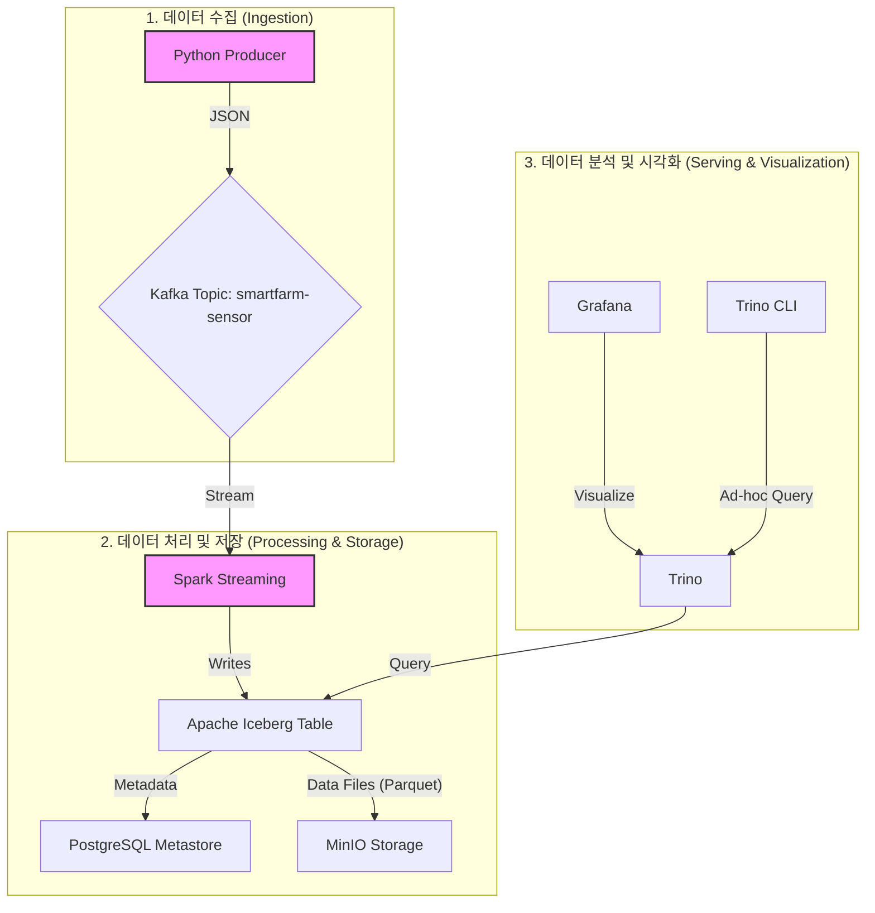

# SmartFarm Lakehouse Project

## 1. 프로젝트 개요

본 프로젝트는 스마트팜에서 수집되는 센서 데이터를 실시간으로 처리하고 분석하기 위한 최신 데이터 레이크하우스 아키텍처를 구축합니다. Kafka, Spark, Iceberg, Trino, MinIO 등 오픈소스 기술을 활용하여 데이터의 수집, 처리, 저장, 분석 및 시각화 파이프라인을 구현합니다.

## 2. 아키텍처

아래 다이어그램은 본 프로젝트의 데이터 흐름과 아키텍처를 보여줍니다.



**데이터 흐름:**

1.  **수집**: Python 스크립트(`sensor_producer.py`)가 가상의 스마트팜 센서 데이터를 생성하여 Kafka 토픽으로 전송합니다.
2.  **처리**: Spark Streaming 애플리케이션(`stream_to_iceberg.py`)이 Kafka 토픽의 데이터를 실시간으로 소비합니다.
3.  **저장**: Spark는 데이터를 Iceberg 테이블 형식으로 변환하여 저장합니다.
    - **데이터 파일 (Parquet)**: MinIO (S3 호환 오브젝트 스토리지)에 저장됩니다.
    - **메타데이터**: PostgreSQL에 저장되어 데이터의 스키마, 파티션 정보, 스냅샷 등을 관리합니다.
4.  **분석 및 시각화**:
    - **Trino**: 분산 SQL 쿼리 엔진으로 MinIO에 저장된 Iceberg 데이터를 직접 빠르고 효율적으로 쿼리합니다.
    - **Grafana**: Trino와 연동하여 대시보드를 통해 데이터를 시각화합니다.
    - **Trino CLI**: 데이터 분석가가 Ad-hoc 쿼리를 실행할 수 있습니다.

## 3. 기술 스택

- **Data Ingestion**: `Kafka`
- **Data Processing**: `Apache Spark`
- **Data Storage (Data Lake)**: `MinIO`
- **Table Format**: `Apache Iceberg`
- **Metadata Store**: `PostgreSQL`
- **Query Engine**: `Trino`
- **Data Visualization**: `Grafana`
- **Orchestration**: `Docker-Compose`

## 4. 시작하기

### 사전 요구사항

- Docker
- Docker Compose

### 설치 및 실행

1.  **프로젝트 클론**

    ```bash
    git clone https://github.com/your-username/smartfarm-lakehouse.git
    cd smartfarm-lakehouse
    ```

2.  **Jar 파일 다운로드**

    ```bash
    curl -L -o aws-java-sdk-bundle-1.12.262.jar "https://repo1.maven.org/maven2/com/amazonaws/aws-java-sdk-bundle/1.12.262/aws-java-sdk-bundle-1.12.262.jar"
    curl -L -o commons-pool2-2.11.1.jar "https://repo1.maven.org/maven2/org/apache/commons/commons-pool2/2.11.1/commons-pool2-2.11.1.jar"
    curl -L -o hadoop-aws-3.3.4.jar "https://repo1.maven.org/maven2/org/apache/hadoop/hadoop-aws/3.3.4/hadoop-aws-3.3.4.jar"
    curl -L -o iceberg-aws-bundle-1.4.3.jar "https://repo1.maven.org/maven2/org/apache/iceberg/iceberg-aws-bundle/1.4.3/iceberg-aws-bundle-1.4.3.jar"
    curl -L -o iceberg-spark-runtime-3.5_2.12-1.4.3.jar "https://repo1.maven.org/maven2/org/apache/iceberg/iceberg-spark-runtime-3.5_2.12/1.4.3/iceberg-spark-runtime-3.5_2.12-1.4.3.jar"
    curl -L -o kafka-clients-3.5.1.jar "https://repo1.maven.org/maven2/org/apache/kafka/kafka-clients/3.5.1/kafka-clients-3.5.1.jar"
    curl -L -o postgresql-42.6.0.jar "https://repo1.maven.org/maven2/org/postgresql/postgresql/42.6.0/postgresql-42.6.0.jar"
    curl -L -o spark-sql-kafka-0-10_2.12-3.5.0.jar "https://repo1.maven.org/maven2/org/apache/spark/spark-sql-kafka-0-10_2.12/3.5.0/spark-sql-kafka-0-10_2.12-3.5.0.jar"
    curl -L -o spark-token-provider-kafka-0-10_2.12-3.5.0.jar "https://repo1.maven.org/maven2/org/apache/spark/spark-token-provider-kafka-0-10_2.12/3.5.0/spark-token-provider-kafka-0-10_2.12-3.5.0.jar"

    ```

3.  **모든 서비스 실행**
    `docker-compose.yml` 파일이 있는 프로젝트 루트 디렉토리에서 아래 명령어를 실행하여 모든 서비스를 시작합니다.

    ```bash
    docker-compose up -d
    ```

4.  **bucket 생성**
    mino 접속 후 `lakehouse` 버킷을 생성합니다.

    ```text
    http://localhost:9001
    ```

5.  **데이터 생성 (Producer 실행)**
    Spark 마스터 컨테이너에 접속하여 데이터 생성 스크립트를 실행합니다.

    ```bash
    docker exec -it lakehouse-spark-master /opt/spark/work-dir/ingestion/sensor_producer.py
    ```

6.  **실시간 데이터 처리 (Consumer/ETL 실행)**
    Spark 마스터 컨테이너에 접속하여 스트리밍 처리 잡을 제출합니다.
    ```bash
    docker exec -it lakehouse-spark-master /opt/spark/bin/spark-submit \
      /opt/spark/work-dir/processing/stream_to_iceberg.py
    ```

## 5. 데이터 접근 방법

### Trino CLI를 통한 데이터 쿼리

1. Trino 컨테이너에 접속합니다.
   ```bash
   docker exec -it lakehouse-trino trino
   ```
2. Iceberg 카탈로그와 스키마를 확인하고 데이터를 쿼리합니다.

   ```sql
   SHOW CATALOGS;
   -- Expected: iceberg, system

   USE iceberg.smartfarm;
   SHOW TABLES;
   -- Expected: sensor_data

   SELECT * FROM sensor_data LIMIT 10;

   -- 상태가 'WARNING'인 데이터 조회
   SELECT * FROM sensor_data WHERE status = 'WARNING';
   ```

### Grafana 대시보드

1.  웹 브라우저에서 `http://localhost:3000`으로 접속합니다.
2.  초기 로그인 정보 (admin / admin)를 사용하여 로그인합니다.
3.  **Connections > Data sources**에서 `Trino` 데이터 소스를 추가하거나 설정합니다.
    - **Host**: `http://lakehouse-trino:8080`
    - **Catalog**: `iceberg`
    - **Schema**: `smartfarm`
4.  대시보드를 생성하여 `sensor_data` 테이블의 데이터를 시각화합니다.

## 6. 프로젝트 구조

```
.
├── conf/                 # Spark, Trino 설정 파일
├── data/                 # MinIO, PostgreSQL, Kafka 등 로컬 데이터
├── jars/                 # Spark에서 사용할 외부 JAR 파일
├── src/                  # 소스 코드
│   ├── ingestion/        # 데이터 수집 스크립트 (Producer)
│   └── processing/       # 데이터 처리 스크립트 (Spark Streaming)
├── docker-compose.yml    # 서비스 오케스트레이션 파일
└── README.md             # 프로젝트 문서
```
